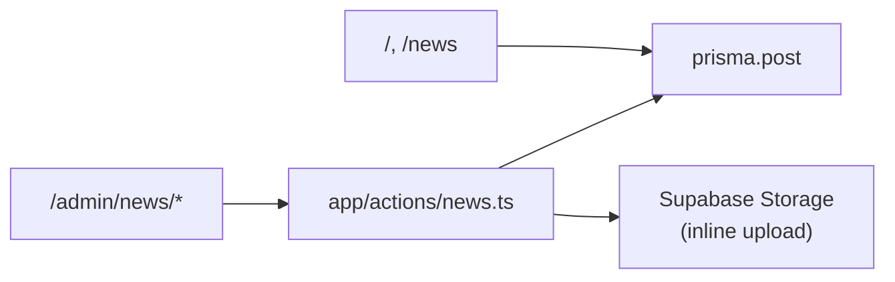

# Design — Admin News & Announcements (Simplified)

## Approach

Copy the **document requests admin pattern**: Server Components query Prisma directly; Server Actions handle mutations only. No extra type modules, no storage abstraction layer, no property tests.



## Database

`Post` model (already in schema):

```prisma
model Post {
  id         String   @id @default(uuid())
  headline   String   @db.VarChar(200)
  caption    String   @db.VarChar(500)
  imageUrls  String[]          // v1 uses at most imageUrls[0]
  isFeatured Boolean  @default(false)
  createdAt  DateTime @default(now())
  updatedAt  DateTime @updatedAt
}
```

## Files to add or change

| File | Purpose |
|---|---|
| `app/actions/news.ts` | Mutations: `createPost`, `updatePost`, `deletePost`, `toggleFeatured`. Zod validation + `requireAdmin`. Image upload/delete inline here (~30 lines, not a separate module). |
| `app/admin/news/page.tsx` | List page — `prisma.post.findMany`, same card style as requests |
| `app/admin/news/new/page.tsx` | Create form |
| `app/admin/news/[id]/edit/page.tsx` | Edit form |
| `app/admin/news/_components.tsx` | `PostForm` + small client helpers (delete confirm, feature toggle) |
| `app/admin/layout.tsx` | Add "News" nav link |
| `components/AnnouncementsSection.tsx` | Server Component: `prisma.post.findMany({ take: 3 })` |
| `components/NewsContent.tsx` | Server Component: fetch posts; thin client child for modal |
| `components/AnnouncementModal.tsx` | Accept a minimal post shape (headline, caption, date, image) |

**Not creating:** `lib/types/post.ts`, `lib/storage.ts`, `PostModal.tsx`, `getPosts`/`getTopPosts` action wrappers.

## Server action shape

One file, four mutations — mirrors `adminRequests.ts`:

```typescript
// app/actions/news.ts
"use server";

// requireAdmin() — same as adminRequests.ts
// postSchema — headline + caption only

createPost(prev, formData)   // optional single File in formData
updatePost(id, prev, formData)
deletePost(id)               // best-effort storage cleanup
toggleFeatured(id)           // transaction: unfeature all, feature this one
```

**Image handling (inline):** On create/update, if `formData` has an `image` file, upload to Supabase `post-images` bucket via service-role client, push URL into `imageUrls`. On replace/remove, delete old file best-effort. Cap at 1 image in the form UI.

**Featured toggle:** `prisma.$transaction([updateMany false, update one true])` — same as current plan, but it's 5 lines, not a subsystem.

## Admin UI

Keep it flat — one `_components.tsx` with:

- **`PostForm`** — `useActionState`, headline + caption + single file input. Character counters via `maxLength`.
- **`FeatureButton`** — calls `toggleFeatured`, `useTransition` for pending state.
- **`DeleteButton`** — `window.confirm` or a tiny modal; calls `deletePost`.

List page stays a **Server Component** (like `admin/requests/page.tsx`) — no `PostList` / `PostCard` wrapper components unless the page gets long.

## Public pages

1. **`AnnouncementsSection`** — async server component fetches top 3. Pass to a small `"use client"` child only for modal open/close state.
2. **`NewsContent`** — async server component fetches all, splits featured vs rest. Same modal pattern.
3. Reuse **`AnnouncementModal`** with a mapped shape: `{ title: headline, excerpt: caption, date, fullContent: caption, imageUrl }`.

## What we dropped from the original design

| Removed | Why |
|---|---|
| `lib/types/post.ts` | Use `Post` from `@prisma/client` |
| `lib/storage.ts` | ~30 lines inline in actions is enough |
| `getPosts` / `getTopPosts` actions | Public pages query Prisma directly |
| `ImageUploader` component | Single `<input type="file">` in `PostForm` |
| `PostModal` | Extend existing modal |
| Property tests (`fast-check`) | Overkill for this feature |
| 5-image gallery | v2 if needed; schema already supports array |
| Formal SHALL requirements | Plain checklist instead |

## Auth

`requireAdmin()` in every mutation. Admin pages rely on existing admin layout; add explicit check at top of news pages if needed (match how requests works today).
