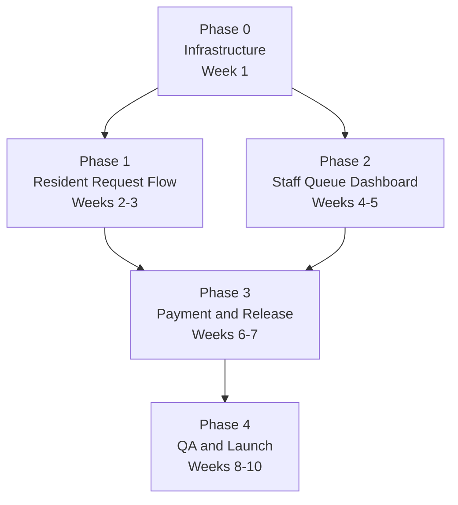

# Implementation Phases — Barangay Mulawin V2

**Project:** Barangay Mulawin — Digital Services Portal (V2)
**Date:** 2026-07-01
**Version:** 0.1
**Owner:** Earl Clyde Bañez
**Status:** Draft

This document is the canonical implementation roadmap. It maps every PRD milestone (M0–Launch) to concrete code tasks, file-level changes, acceptance gates, and inter-phase dependencies.

**Reference documents:**
- [brd-mulawin-v2.md](brd-mulawin-v2.md) — Why build this
- [prd-mulawin-v2.md](prd-mulawin-v2.md) — What to build (milestones M0–Launch)
- [dsd-mulawin-v2.md](dsd-mulawin-v2.md) — How it looks
- [sdd-mulawin-v2.md](sdd-mulawin-v2.md) — How it's built (schema, auth, API)
- [rfc-mulawin-v2-request-lifecycle.md](rfc-mulawin-v2-request-lifecycle.md) — State machine + contracts
- [qad-mulawin-v2.md](qad-mulawin-v2.md) — QA & test plan
- [gtm-mulawin-v2.md](gtm-mulawin-v2.md) — Launch plan
- [onboarding-mulawin-v2.md](onboarding-mulawin-v2.md) — Staff + resident onboarding
- [plan-website-mulawin-v2.md](plan-website-mulawin-v2.md) — Copy & UX spec for new routes

---

## Dependency Diagram



Phase 1 and Phase 2 both depend on Phase 0 (schema + auth). They have no dependency on each other and can be worked sequentially in either order. Phase 3 requires both Phase 1 and Phase 2 to be gate-complete. Phase 4 begins only after Phase 3 passes its gate.

---

## Phase 0 — Infrastructure

**PRD Milestone:** M0
**Target:** Week 1
**Gate:** `npm run build` passes on `main` with Prisma connected to Neon and NextAuth staff session working end-to-end. Staff can log in at `/admin/login` and be redirected to `/admin/requests`.

### Dependencies
- Neon PostgreSQL project created (free tier) — connection string ready before this phase starts
- `.env.local` populated with `DATABASE_URL`, `NEXTAUTH_SECRET`, `NEXTAUTH_URL`

### Tasks

**1. Install dependencies**
```bash
npm install prisma @prisma/client next-auth@beta zod react-hook-form
npm install --save-dev @types/bcryptjs bcryptjs
npx prisma init
```

**2. Create Prisma schema**

File: `prisma/schema.prisma`

Models to define (see [sdd-mulawin-v2.md](sdd-mulawin-v2.md) §3 for full field list):
- `RequestStatus` enum: `SUBMITTED`, `UNDER_REVIEW`, `FOR_PICKUP`, `NEEDS_REVISION`, `REJECTED`, `RELEASED`
- `DocumentType` enum: `BARANGAY_CLEARANCE`, `CERTIFICATE_OF_RESIDENCY`, `CERTIFICATE_OF_INDIGENCY`, `BUSINESS_PERMIT`
- `DocumentRequest` — core request record with `refNumber`, `status`, `fullName`, `contactNumber`, `address`, `purpose`, `documentType`, `feeAmount`, `submittedAt`
- `RequestStatusLog` — immutable audit trail: `requestId`, `fromStatus`, `toStatus`, `changedBy`, `changedAt`, `note`
- `PaymentRecord` — linked 1:1 to a released request: `requestId`, `amountCollected`, `orNumber`, `releasedBy`, `releasedAt`
- `User` — staff only: `email`, `passwordHash`, `name`, `role`

**3. Run initial migration**
```bash
npx prisma migrate dev --name init
```

**4. Seed one staff user**

File: `prisma/seed.ts`
- Hash password with `bcryptjs`
- Insert `remil@brgymulawin.gov.ph` with role `STAFF`

Add to `package.json`:
```json
"prisma": { "seed": "ts-node prisma/seed.ts" }
```

Run: `npx prisma db seed`

**5. Configure NextAuth**

File: `app/api/auth/[...nextauth]/route.ts`
- `CredentialsProvider` — look up user by email, compare `bcryptjs.compare(password, user.passwordHash)`
- Session strategy: `jwt`
- Callbacks: include `user.id` and `user.role` in the JWT token

**6. Protect admin routes**

File: `middleware.ts` (root of project)
- Match `/admin/:path*`
- If no session token → redirect to `/admin/login`
- If session but role is not `STAFF` → 403 page or redirect

**7. Verify build**
```bash
npm run build
```

### Done Criteria (Phase 0 Gate)
- [ ] `prisma/schema.prisma` defines all models and enums
- [ ] `npx prisma migrate status` shows migration applied on Neon
- [ ] `prisma/seed.ts` inserts Remil's user record without error
- [ ] `GET /admin/requests` (unauthenticated) redirects to `/admin/login`
- [ ] Staff can log in at `/admin/login` and session is maintained
- [ ] `npm run build` exits 0 on CI

---

## Phase 1 — Resident Request Flow

**PRD Milestone:** M1
**Target:** Weeks 2–3
**Gate:** A resident can complete the 3-step form, receive a reference number on screen, and look up that reference number at `/track` to see `SUBMITTED` status with a plain-language instruction.

### Dependencies
- Phase 0 gate passed (Prisma schema live, `POST /api/requests` can write to DB)

### New Files

| File | Purpose |
|------|---------|
| `app/request/page.tsx` | 3-step form shell — client component managing step state |
| `app/request/components/StepDocumentType.tsx` | Step 1: document type selector cards |
| `app/request/components/StepPersonalInfo.tsx` | Step 2: `fullName`, `contactNumber`, `address`, `purpose` fields with inline validation |
| `app/request/components/StepReview.tsx` | Step 3: summary + fee notice + submit button |
| `app/request/components/SuccessScreen.tsx` | Reference number display + copy button + "Track My Request" link |
| `app/track/page.tsx` | Reference number input + status result card |
| `app/api/requests/route.ts` | `POST` — Zod-validate body, generate ref number, write to DB, return `{ refNumber }` |
| `app/api/requests/track/route.ts` | `GET ?ref=MUL-YYYY-XXXXXX` — return request status + last log entry |
| `lib/refNumber.ts` | `generateRefNumber()` — format: `MUL-{YYYY}-{zero-padded 6-digit sequence}` |

### Edits to Existing Files

| File | Change |
|------|--------|
| `components/Header.tsx` | Add "Request a Document" link after "Services" in desktop nav and in mobile menu |
| `app/page.tsx` | Add "Request a Document →" CTA button in hero section alongside existing CTAs |
| `app/services/page.tsx` | Add "Request Online →" link on each document card pointing to `/request?type=[document-type]` |

### Key Implementation Notes

**Reference number format** (`lib/refNumber.ts`):
```ts
// MUL-2026-001234
// Sequence is the current count of requests for that year + 1
// Padded to 6 digits to handle up to 999,999 requests per year
export async function generateRefNumber(prisma: PrismaClient): Promise<string> {
  const year = new Date().getFullYear();
  const count = await prisma.documentRequest.count({ where: { submittedAt: { gte: new Date(`${year}-01-01`) } } });
  return `MUL-${year}-${String(count + 1).padStart(6, "0")}`;
}
```

**POST /api/requests — Zod schema** (`app/api/requests/route.ts`):
```ts
const RequestSchema = z.object({
  documentType: z.enum(["BARANGAY_CLEARANCE", "CERTIFICATE_OF_RESIDENCY", "CERTIFICATE_OF_INDIGENCY", "BUSINESS_PERMIT"]),
  fullName: z.string().min(3),
  contactNumber: z.string().regex(/^09\d{9}$/),
  address: z.string().min(10),
  purpose: z.string().min(5),
});
```

**Status label mapping** for `/track` page — see [plan-website-mulawin-v2.md](plan-website-mulawin-v2.md) §`/track` for the full resident-facing label and instruction per status value.

**Form state preservation on error:** If the `POST /api/requests` call fails (network error, 500), form data must remain populated so the resident does not need to re-enter everything. Handle in `StepReview.tsx` — catch the error, set an error banner, keep the form state.

### Done Criteria (Phase 1 Gate)
- [ ] Resident can complete all 3 steps and submit without a refresh
- [ ] Each step validates required fields inline — cannot advance with empty/invalid data
- [ ] On success, reference number is shown in format `MUL-YYYY-XXXXXX`
- [ ] Copy-to-clipboard button on success screen works
- [ ] `/track?ref=MUL-YYYY-XXXXXX` returns the correct status and instruction
- [ ] Invalid reference number at `/track` shows "not found" message
- [ ] "Request a Document" appears in the main nav and homepage hero
- [ ] `npm run build` exits 0

---

## Phase 2 — Staff Queue Dashboard

**PRD Milestone:** M2 (partial — status transitions, no release yet)
**Target:** Weeks 4–5
**Gate:** Staff can log in, view all requests in a filterable table, click a request row to see full details, and update status to `UNDER_REVIEW`, `FOR_PICKUP`, `NEEDS_REVISION`, or `REJECTED`. The audit log records every transition.

### Dependencies
- Phase 0 gate passed (NextAuth session, protected `/admin/*` routes)
- Phase 1 gate passed (requests exist in DB to view and process)

### New Files

| File | Purpose |
|------|---------|
| `app/admin/login/page.tsx` | Email + password form; calls `signIn("credentials")` from NextAuth |
| `app/admin/requests/page.tsx` | Queue table with filter tabs (All / Submitted / Under Review / For Pickup / Needs Revision / Released / Rejected) |
| `app/admin/requests/[id]/page.tsx` | Full request detail + right-side action panel |
| `app/admin/requests/[id]/components/ActionPanel.tsx` | Renders correct action buttons based on current status |
| `app/admin/requests/[id]/components/StatusTimeline.tsx` | Chronological list of all `RequestStatusLog` entries |
| `app/api/admin/requests/route.ts` | `GET` — paginated list with optional `status` filter query param |
| `app/api/admin/requests/[id]/route.ts` | `GET` — full request detail including status log |
| `app/api/admin/requests/[id]/status/route.ts` | `PATCH { toStatus, note? }` — enforces `validateTransition()`, writes log entry |
| `lib/validateTransition.ts` | State machine — see [rfc-mulawin-v2-request-lifecycle.md](rfc-mulawin-v2-request-lifecycle.md) §3 |

### Key Implementation Notes

**`validateTransition()` function** (`lib/validateTransition.ts`):
```ts
// Allowed transitions (from RFC §3)
const ALLOWED: Record<RequestStatus, RequestStatus[]> = {
  SUBMITTED:      ["UNDER_REVIEW", "REJECTED"],
  UNDER_REVIEW:   ["FOR_PICKUP", "NEEDS_REVISION", "REJECTED"],
  FOR_PICKUP:     ["RELEASED"],
  NEEDS_REVISION: ["UNDER_REVIEW", "REJECTED"],
  REJECTED:       [],
  RELEASED:       [],
};

export function validateTransition(from: RequestStatus, to: RequestStatus): void {
  if (!ALLOWED[from].includes(to)) {
    throw new Error(`Invalid transition: ${from} → ${to}`);
  }
}
```

**`PATCH /api/admin/requests/[id]/status` flow:**
1. Verify staff session (NextAuth `getServerSession`)
2. Fetch current request status from DB
3. Call `validateTransition(current, toStatus)` — throw 400 if invalid
4. `NEEDS_REVISION` and `REJECTED` require a non-empty `note`
5. Write new `RequestStatusLog` entry (immutable — never update, only insert)
6. Update `DocumentRequest.status`
7. Return updated request

**Admin table columns:** Ref Number, Name, Document Type, Date Submitted, Status badge, action link "View →"

**Confirmation dialogs:** `REJECTED` and `NEEDS_REVISION` actions must show a modal requiring a reason before the `PATCH` is sent. `FOR_PICKUP` shows a simple "Are you sure?" confirm dialog.

### Done Criteria (Phase 2 Gate)
- [ ] `/admin/requests` shows all requests, sortable by submission date
- [ ] Filter tabs correctly filter by status
- [ ] Staff can navigate to a request detail page
- [ ] "Mark For Pickup" transitions status from `UNDER_REVIEW` → `FOR_PICKUP` and creates a log entry
- [ ] "Needs Revision" requires a non-empty reason; resident sees it on `/track`
- [ ] "Reject" requires a non-empty reason; audit log records staff name + timestamp
- [ ] Attempting an illegal transition (e.g. `SUBMITTED → RELEASED`) returns a 400 error
- [ ] Status history timeline is visible on the detail page
- [ ] `npm run build` exits 0

---

## Phase 3 — Payment Recording & Release

**PRD Milestone:** M2 (completion) + M3
**Target:** Weeks 6–7
**Gate:** Staff can record cash payment details (OR number, amount, receiver) and atomically mark a request as `RELEASED`. The `PaymentRecord` row and the `RequestStatusLog` entry are both written in a single Prisma transaction. A printable claim slip can be generated from the browser.

### Dependencies
- Phase 2 gate passed (`FOR_PICKUP` status reachable; action panel rendering works)

### New Files

| File | Purpose |
|------|---------|
| `app/api/admin/requests/[id]/release/route.ts` | `POST { orNumber, amountCollected, releasedBy }` — atomic Prisma `$transaction` |
| `app/admin/requests/[id]/components/ReleaseModal.tsx` | Modal form for OR number, amount, receiver name — submits to release endpoint |
| `app/admin/requests/[id]/components/ClaimSlip.tsx` | Print-only component — `@media print` CSS, shows ref number, name, doc type, date |

### Key Implementation Notes

**Atomic release transaction** (`app/api/admin/requests/[id]/release/route.ts`):
```ts
// From RFC §7 — all three writes in one transaction
await prisma.$transaction([
  prisma.paymentRecord.create({ data: { requestId, orNumber, amountCollected, releasedBy, releasedAt: new Date() } }),
  prisma.requestStatusLog.create({ data: { requestId, fromStatus: "FOR_PICKUP", toStatus: "RELEASED", changedBy: releasedBy, changedAt: new Date(), note: `OR: ${orNumber}, Amount: ₱${amountCollected}` } }),
  prisma.documentRequest.update({ where: { id: requestId }, data: { status: "RELEASED" } }),
]);
```

**Release validation rules** (enforced server-side before the transaction):
- `orNumber` must be non-empty
- `amountCollected` must be a positive number matching the `DocumentRequest.feeAmount`
- `releasedBy` must be non-empty
- Request must be in `FOR_PICKUP` status — reject with 409 if not

**If transaction fails:** Return 500 with a clear error. Staff sees the error before the resident is turned away. The resident is NOT marked released. Staff retries.

**Claim slip** (`ClaimSlip.tsx`):
- Hidden in normal view — only visible when `window.print()` is called
- Fields: Barangay Mulawin header, reference number, resident name, document type, date submitted, date released, OR number, amount paid
- Plain table layout — no Tailwind classes that break print

### Done Criteria (Phase 3 Gate)
- [ ] "Record Release" button is visible and enabled only when status is `FOR_PICKUP`
- [ ] Release modal requires OR number, amount, and receiver name — all 3 must be filled
- [ ] On confirm, all 3 DB writes succeed atomically (verify in Prisma Studio)
- [ ] If any DB write fails, none of the 3 are committed
- [ ] After release, request status shows `RELEASED` and moves off the active queue
- [ ] Audit log shows the release entry with OR number, amount, and timestamp
- [ ] "Print Claim Slip" triggers the browser print dialog with the correct slip layout
- [ ] `npm run build` exits 0

---

## Phase 4 — QA, Hardening & Launch

**PRD Milestone:** M4 + Launch
**Target:** Weeks 8–10
**Gate:** QAD release criteria met (see [qad-mulawin-v2.md](qad-mulawin-v2.md) §Release Criteria). Staff onboarding walkthrough complete with Remil. GTM assets live.

### Dependencies
- Phase 3 gate passed (full end-to-end flow functional in staging)

### Tasks

**QA (Week 8)**
- Run all happy path tests from [qad-mulawin-v2.md](qad-mulawin-v2.md):
  - US-01: Submit → reference number
  - US-02: Track → status
  - US-03: Staff queue view + filter
  - US-04: Approve / flag / reject
  - US-05: Release + audit log
- Run all sad path / edge case tests:
  - Illegal transition attempt → 400 returned, no state change
  - Release with missing OR number → blocked
  - Invalid reference number at `/track` → "not found"
  - Concurrent release attempt (duplicate OR number) → handled
- Mobile smoke test: Complete resident flow on actual Android + iOS device

**Hardening (Week 9)**

Files to edit:
- `app/request/page.tsx` — add React error boundary around the form; on uncaught error show "Something went wrong" with retry button, form data preserved
- `app/admin/requests/page.tsx` — add error boundary; on data fetch failure show retry prompt rather than blank screen
- `app/api/requests/route.ts` — add rate limiting header (basic: check IP frequency with a simple in-memory map; defer Redis to V3)
- All `app/api/admin/**` routes — double-check `getServerSession()` guard is present on every handler

**Staff Onboarding (Week 9)**
- Conduct 10-minute live walkthrough with Remil at the barangay hall desktop (see [onboarding-mulawin-v2.md](onboarding-mulawin-v2.md) Part A §4)
- Remil completes one full cycle independently (submit test request as resident → process as staff → record release)
- Print and hand over the Quick Reference Card (from [onboarding-mulawin-v2.md](onboarding-mulawin-v2.md) Part A §3)
- Sign-off: Remil confirms she can run the daily workflow without assistance

**Production Deploy (Week 10)**
- Confirm Neon production DB connection string is set in Vercel environment variables (not `.env.local`)
- Run `npx prisma migrate deploy` against production DB (not `migrate dev`)
- Run `npx prisma db seed` to create Remil's production staff account
- Deploy to Vercel production via `git push origin main` (CI → Vercel auto-deploy)
- Smoke-test all 5 user stories in production before announcing

**GTM Assets (Week 10)**
- Publish Facebook announcement post (see [gtm-mulawin-v2.md](gtm-mulawin-v2.md) §5 for copy)
- Print QR poster (A4) pointing to `/request` — post at barangay hall entrance and bulletin board
- Brief kagawads via Messenger to share the link with their networks

### Done Criteria (Phase 4 Gate — Launch Ready)
- [ ] All Must-Have features from PRD §3 pass their acceptance criteria in production
- [ ] No P0 or P1 bugs open
- [ ] Remil has completed the onboarding walkthrough and signed off
- [ ] Facebook announcement post published
- [ ] QR poster posted at barangay hall
- [ ] Vercel production deploy shows green build
- [ ] Neon production DB has all migrations applied and staff seed present

---

## Backlog (Post-V2 / V3)

The following items were deferred from V2 scope. They are tracked here to avoid losing context.

| Item | Source | Notes |
|------|--------|-------|
| SMS/email notifications on status change | PRD §6 | Requires Twilio or SendGrid; adds `NEXTAUTH_EMAIL` config |
| Self-service staff password reset | SDD §1 known tech debt | V2: manual reset via Prisma Studio |
| Rate limiting on resident endpoints | SDD §1 known tech debt | V2: none; V3: Redis-backed IP throttle |
| Resident ID photo upload at submission | PRD §3 (Could-Have) | Requires Vercel Blob or S3; deferred if time-constrained |
| Online payment (GCash / Maya) | PRD §6 | Requires PCI gateway + BSP considerations |
| Public announcement editing via admin UI | PRD §6 | Separate CMS feature |
| Appointment slot scheduling | PRD §6 | Separate future feature |
| Request history for residents with account | SDD §1 known trade-off | Requires resident auth system |

---

## Environment Variable Checklist

| Variable | Used By | Set In |
|----------|---------|--------|
| `DATABASE_URL` | Prisma | Vercel env vars + `.env.local` |
| `NEXTAUTH_SECRET` | NextAuth | Vercel env vars + `.env.local` |
| `NEXTAUTH_URL` | NextAuth | Vercel env vars + `.env.local` |
| `NEXTAUTH_URL_INTERNAL` | NextAuth (Vercel) | Vercel env vars only |

Generate `NEXTAUTH_SECRET`:
```bash
openssl rand -base64 32
```

---

*This document supersedes the milestone table in [prd-mulawin-v2.md](prd-mulawin-v2.md) §9 for implementation purposes. The PRD milestones remain authoritative for scope decisions; this document governs the execution sequence.*
