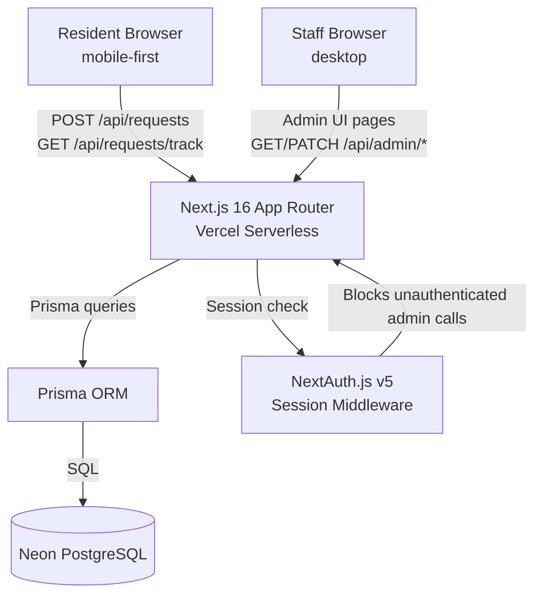

# System Design Document (SDD)

**Project:** Barangay Mulawin — Digital Services Portal (V2)
**Date:** 2026-07-01
**Version:** 0.1
**Owner:** Earl Clyde Bañez
**Status:** Draft
**PRD:** [prd-mulawin-v2.md](prd-mulawin-v2.md)

---

## 1. Architectural Vision & Principles

**Architecture style:** Next.js 16 App Router monolith deployed on Vercel. The resident-facing UI and admin dashboard are both Next.js pages. API Routes under `app/api/` serve as the REST backend. Prisma ORM connects to a PostgreSQL database hosted on Neon (serverless free tier — sufficient for V2 request volume of ~100/day). No separate backend service, no microservices, no message queue. One repo, one deploy.

**Guiding principles:**

- **Boring tech over clever tech.** Prisma + Postgres is well-understood and debuggable by any Next.js developer. Avoid novel patterns that make onboarding harder for a single-dev project.
- **Server is the source of truth.** Status transitions are enforced at the API layer via a `validateTransition()` function. The UI reflects what the server confirms — it never optimistically updates status.
- **Fail visibly, never silently.** If a request submission fails, the resident sees a clear error and their data is not lost (form state preserved). If a release fails, staff sees the error before the resident is sent away.
- **Minimal PII surface.** We store only what is necessary to process the request: name, contact number, purpose. No passwords for residents. No ID scan storage in V2.

**Key trade-offs made:**

- **Monolith over API + separate frontend:** Simplicity wins at this scale. Vercel handles cold starts well for Next.js API routes. Trade-off: vertical scaling is limited, but ~100 requests/day never approaches that ceiling.
- **No resident accounts:** Reference number as the only resident identifier removes the need for auth infrastructure for residents. Trade-off: residents cannot log in to see history — they must keep the reference number.
- **Neon free tier over self-hosted Postgres:** Zero ops overhead. Trade-off: 0.5s cold start on first query after inactivity. Acceptable for a barangay hall that opens at 8 AM.

**Known V2 tech debt:**

- No SMS/email notifications — residents must actively check `/track`.
- No rate limiting on resident endpoints (acceptable for V2 volume; add in V3).
- Staff password reset is manual (admin resets via Prisma Studio) — build self-service in V3.

---

## 2. High-Level Architecture



**Layers:**

| Layer | Technology | Responsibility |
|-------|-----------|----------------|
| Resident UI | Next.js App Router, React 19, Tailwind CSS 4 | Request form, reference number screen, status tracking |
| Staff UI | Next.js App Router, React 19, Tailwind CSS 4 | Admin login, queue dashboard, request detail, action modals |
| API Routes | Next.js Route Handlers (`app/api/`) | REST endpoints, input validation, business logic, transition enforcement |
| Auth | NextAuth.js v5 | Staff session management, admin route protection |
| ORM | Prisma 6 | Type-safe DB access, migrations, schema management |
| Database | Neon PostgreSQL (serverless) | Persistent storage for all request, payment, and audit data |
| Infrastructure | Vercel (hosting), GitHub Actions (CI) | Build pipeline, preview deploys, production deploys |

---

## 3. Data Architecture

**Primary database:** PostgreSQL via Neon — *reason: relational integrity is essential for the status machine and audit log; Prisma's typed client eliminates a class of bugs at the data layer.*

**Secondary / cache:** None in V2 — request volume does not justify a cache layer.

**Vector store:** N/A

**Core entities (Prisma schema):**

```prisma
// prisma/schema.prisma

generator client {
  provider = "prisma-client-js"
}

datasource db {
  provider = "postgresql"
  url      = env("DATABASE_URL")
}

enum RequestStatus {
  SUBMITTED
  UNDER_REVIEW
  NEEDS_REVISION
  FOR_PICKUP
  RELEASED
  REJECTED
}

model StaffUser {
  id           String   @id @default(cuid())
  email        String   @unique
  passwordHash String
  name         String
  role         String   @default("staff") // "staff" | "admin"
  createdAt    DateTime @default(now())

  statusLogs   RequestStatusLog[]
  payments     Payment[]
}

model DocumentType {
  id              String   @id @default(cuid())
  code            String   @unique // e.g. "CLEARANCE", "RESIDENCY"
  name            String
  fee             Int      // in PHP centavos (e.g. 5000 = ₱50.00)
  requirements    String[] // list of required items shown on form
  processingHours Int      @default(24)
  active          Boolean  @default(true)

  requests        DocumentRequest[]
}

model DocumentRequest {
  id             String        @id @default(cuid())
  referenceNo    String        @unique // e.g. "MUL-2026-001234"
  documentTypeId String
  documentType   DocumentType  @relation(fields: [documentTypeId], references: [id])

  // Resident info (no account — stored per request)
  fullName       String
  contactNumber  String
  address        String
  purpose        String

  status         RequestStatus @default(SUBMITTED)
  revisionNote   String?       // set when status = NEEDS_REVISION
  rejectionReason String?      // set when status = REJECTED

  submittedAt    DateTime      @default(now())
  updatedAt      DateTime      @updatedAt

  statusLogs     RequestStatusLog[]
  payment        Payment?
}

model RequestStatusLog {
  id          String        @id @default(cuid())
  requestId   String
  request     DocumentRequest @relation(fields: [requestId], references: [id])

  fromStatus  RequestStatus?
  toStatus    RequestStatus
  note        String?
  changedById String?
  changedBy   StaffUser?    @relation(fields: [changedById], references: [id])
  changedAt   DateTime      @default(now())
}

model Payment {
  id           String          @id @default(cuid())
  requestId    String          @unique
  request      DocumentRequest @relation(fields: [requestId], references: [id])

  amountDue    Int             // in centavos, from DocumentType.fee
  amountPaid   Int
  orNumber     String          // Official Receipt number
  receivedById String
  receivedBy   StaffUser       @relation(fields: [receivedById], references: [id])
  paidAt       DateTime        @default(now())
}
```

**Key relationships:**

- `DocumentRequest` belongs to one `DocumentType` (N:1)
- `DocumentRequest` has many `RequestStatusLog` entries (1:N) — immutable audit trail
- `DocumentRequest` has at most one `Payment` (1:1) — created only at release
- `StaffUser` is the actor on status logs and payments

**Caching strategy:**

- No cache layer in V2. All reads hit Neon directly.
- Neon serverless driver handles connection pooling. Cold start ~0.5s after inactivity — acceptable.
- Staff queue page uses `cache: 'no-store'` on fetch to always show live data.

---

## 4. API Design & External Integrations

**API style:** REST via Next.js Route Handlers. Input validated with `zod`. Responses follow `{ data, error }` envelope.

**Resident endpoints (no auth required):**

| Method | Path | Purpose |
|--------|------|---------|
| `POST` | `/api/requests` | Submit a new document request; returns `referenceNo` |
| `GET` | `/api/requests/track?ref=MUL-2026-XXXXXX` | Fetch status + instruction for a reference number |

**Admin endpoints (NextAuth session required — 401 if unauthenticated):**

| Method | Path | Purpose |
|--------|------|---------|
| `GET` | `/api/admin/requests` | List all requests; supports `?status=SUBMITTED` filter |
| `GET` | `/api/admin/requests/[id]` | Fetch full request detail including logs |
| `PATCH` | `/api/admin/requests/[id]/status` | Transition status; validates via `validateTransition()` |
| `POST` | `/api/admin/requests/[id]/release` | Record payment + mark RELEASED atomically |
| `GET` | `/api/admin/requests/[id]/claim-slip` | Return plain HTML for printable claim slip |

**Reference number format:** `MUL-YYYY-XXXXXX` where `YYYY` = current year and `XXXXXX` = zero-padded sequential integer per year. Generated server-side at submission.

**External integrations:**

| Service | Purpose | Fallback |
|---------|---------|----------|
| Neon PostgreSQL | Primary persistence | On connection error → 500 with user-friendly message; form data preserved on client |
| NextAuth.js | Staff session management | On session expiry → redirect to `/admin/login` |
| Vercel | Hosting + serverless runtime | Vercel 99.99% SLA; no self-managed fallback needed at V2 scale |

---

## 5. Security & Authorization

**Authentication:** Staff only. Email + bcrypt-hashed password via NextAuth.js v5 Credentials provider. Residents have no accounts.

**Session management:** JWT stored in `httpOnly` cookie. 8-hour session expiry (covers a full work day). On expiry → redirect to login. No "remember me" in V2.

**Authorization model:** Middleware at `middleware.ts` blocks all `/admin/*` routes for unauthenticated requests. API routes additionally call `getServerSession()` and return `401` if no session. Role field on `StaffUser` reserved for V3 (admin vs staff distinction).

**Data protection:**

- PII (name, contact, address): stored in Neon. Neon encrypts at rest by default.
- Staff passwords: `bcryptjs` with salt rounds = 12. Never stored in plain text.
- Secrets: `DATABASE_URL`, `NEXTAUTH_SECRET` in `.env.local` locally; Vercel Environment Variables in production. Never committed to repo (`.gitignore` enforced).
- Input validation: `zod` schemas on all API route inputs. Unknown fields stripped. String lengths capped (name ≤100, purpose ≤500, etc.).
- OR numbers: no uniqueness constraint in V2 (staff may issue the same OR for multiple items) — consider unique index in V3.

---

## 6. Infrastructure, CI/CD & Deployment

**Hosting:** Vercel. Next.js is the framework preset. `vercel.json` already present in repo.

**Database:** Neon PostgreSQL. One project, two branches: `main` (production) and `staging` (preview deploys). `DATABASE_URL` env var points to the correct branch per Vercel environment.

**Environments:**

- `dev`: `next dev` locally. `DATABASE_URL` points to Neon `staging` branch. `NEXTAUTH_SECRET` = any random string.
- `staging`: Vercel preview deploys on every PR. Uses Neon `staging` branch.
- `prod`: Vercel production deploy on push to `main`. Uses Neon `main` branch.

**CI/CD (GitHub Actions — extends existing `ci.yml`):**

```yaml
steps:
  - Checkout
  - Setup Node 20
  - npm ci
  - npm run lint          # ESLint
  - npx tsc --noEmit      # TypeScript check
  - npx prisma generate   # Ensure Prisma client is generated
  - npm run build         # Next.js production build
```

Prisma migrations run manually via `npx prisma migrate deploy` before each production release. No auto-migration on deploy.

---

## 7. Non-Functional Requirements

| Requirement | Target | Notes |
|-------------|--------|-------|
| Resident form submit response | < 1s | Includes DB write + reference number generation |
| Staff queue page load | < 1.5s | Includes Neon cold-start buffer |
| Status transition API | < 500ms | Atomic transaction; no external calls |
| API error rate | < 0.5% | Vercel + Neon combined SLA |
| Uptime | 99.9% | Vercel SLA; Neon 99.95% SLA |
| Max daily requests (V2) | ~100/day | Neon free tier: 0.5 GB storage, 190 compute hours/month — sufficient |
| Data retention | Indefinite for V2 | No deletion policy in V2; revisit at V3 |
| Staff session timeout | 8 hours | Covers full work day; re-login required next day |

---

## 8. AI / Agent Architecture

N/A — no AI components in V2. All request processing is human-reviewed by barangay staff.

---

## Self-Check

- [ ] Section 2 has a Mermaid architecture diagram
- [ ] Section 3 defines all core entities with field types
- [ ] Every external integration in Section 4 has a fallback strategy
- [ ] Section 7 latency targets are specific numbers
- [ ] Section 8 is filled or marked N/A
- [ ] Known V2 shortcuts documented as tech debt in Section 1
- [ ] This document answers *how* to build, not *what* (that's the PRD's job)

---

*Next document: [rfc-mulawin-v2-request-lifecycle.md](rfc-mulawin-v2-request-lifecycle.md)*
